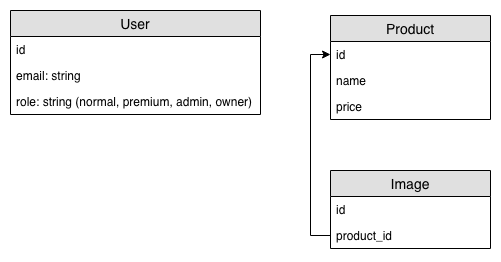

## Use cases

* A user can register as a normal user
* A user can browse products on this website
* A user can choose to purchase premium membership(can skip payment)
* A premium member can see products with discount prices
* A user can be set as admin
* An admin can create/edit products on this website
* A product would have product price/name/image(s)

## Database Schema

https://drive.google.com/file/d/1XtaacOhq8YCGmspAws1bZUJ0pyR_Kdyv/view?usp=sharing

### User

There are four roles of user: `normal`, `premium`, `admin`, `owner`.

Role | normal | premium | admin | owner
-----|--------|---------|-------|------
view Product | V | V | V | V
Product discount | X | V | V | V
create/edit Product | X | V | V | V
promote admin | X | X | X | V
